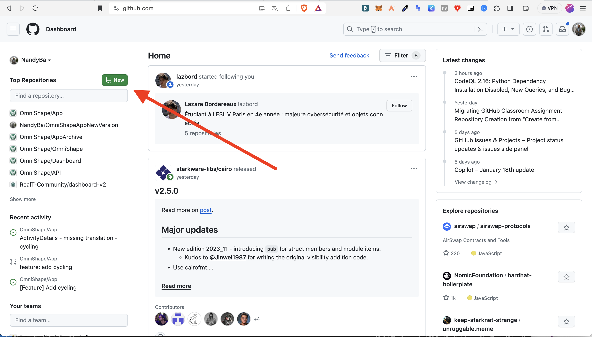
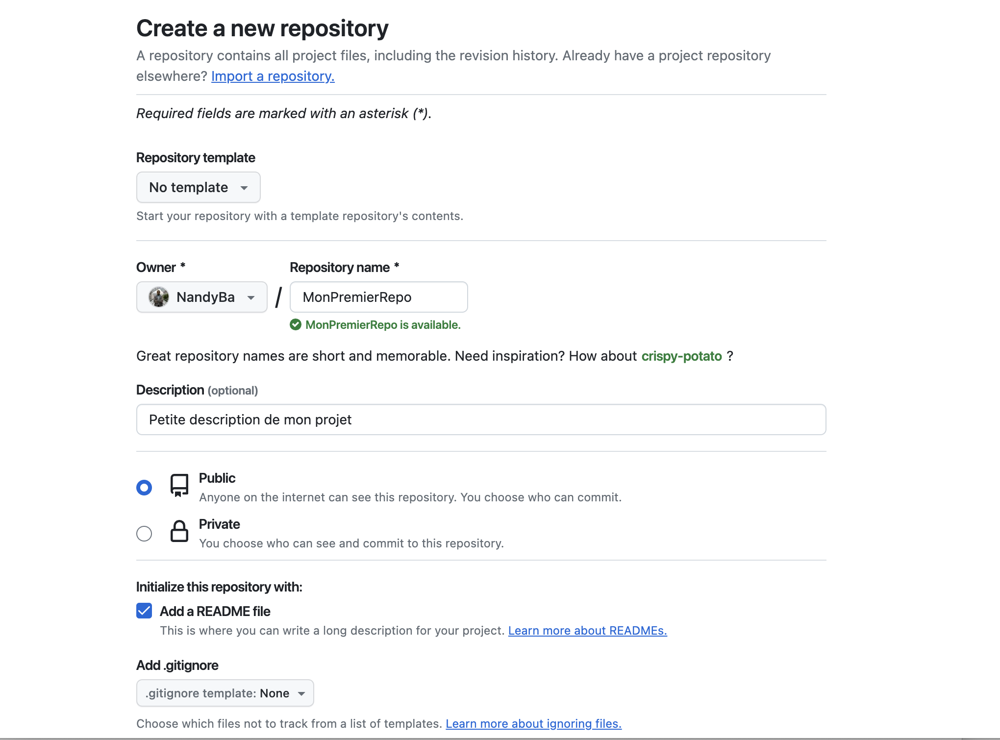
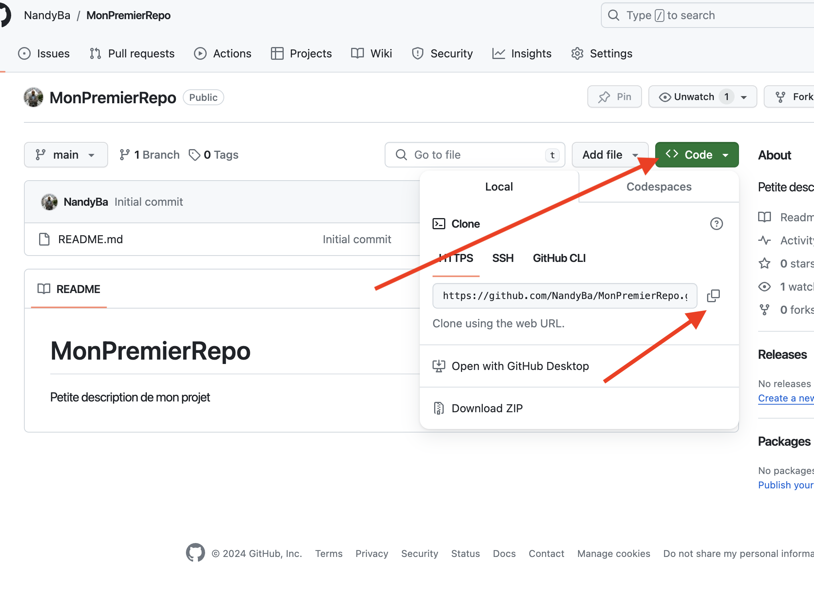
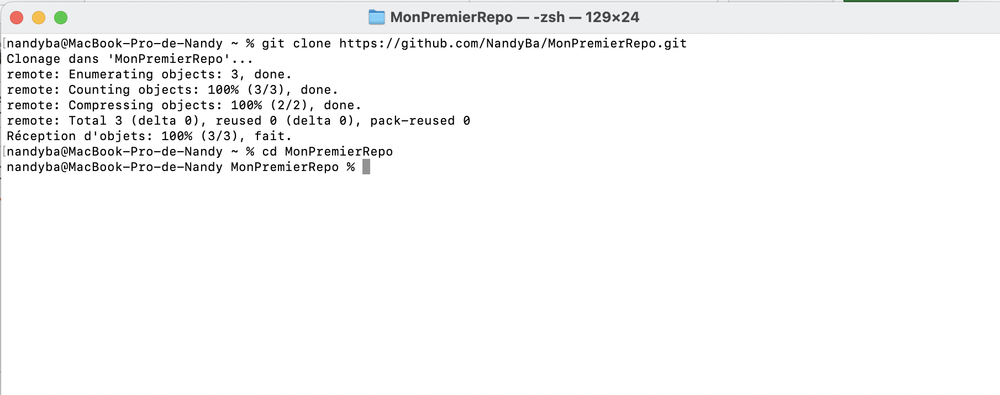

# Guide Pratique

## Introduction à Git

Git est un système de contrôle de version distribué conçu pour gérer tout, des petits aux grands projets, avec rapidité et efficacité. Il est utilisé pour suivre les modifications dans le code source au cours du temps.


## Les commandes git

1. **git init**
   - Description : Initialise un nouveau dépôt Git local.
   - Utilisation : 
        ```bash
        git init
        ```

2. **git clone**
   - Description : Clone un dépôt depuis une source externe.
   - Utilisation : 
        ```bash
        git clone [url]
        ```

3. **git checkout**
   - Description : Crée une nouvelle branche
   - Utilisation : 
        ```bash
        git checkout -b [nom de la branche]
        ```

4. **git add**
   - Utilisation fréquente:
  
        Description : Ajoute tout les fichiers à la zone de préparation (staging area) pour le prochain commit.
        ```bash
        git add .
        ```
   - Utilisation recommendée
    
        Description : Ajoute un fichier à la zone de préparation (staging area) pour le prochain commit.
  
        Pour éviter de publier maladroitement des fichiers d'environnement, des cédentials de base de données ou tout autres fichiers qui ne devrait pas l'être je recommande d'utiliser cette commande
        ```bash
        git add [fichier]
        ```
5. **git status**
   - Description : Montre l'état des fichiers (modifiés, ajoutés, non suivis).
   - Conseil ne pas hésitez à faire un git status avant un git add ou un git commit
   - Utilisation : 
        ```bash
        git status
        ```
   

6. **git commit**
   - Description : Enregistre les modifications dans le dépôt avec un message descriptif.
   - Utilisation : 
        ```bash
        git commit -m "[message de commit]"
        ```


7. **git push**
   - Description : Envoie les modifications de votre dépôt local vers un dépôt distant (appelé remote)
   - Utilisation : 
        ```bash
        git push [remote] [branche]
        ```

8. **git pull**
   - Description : Met à jour le dépôt local avec les modifications du dépôt distant.
   - Utilisation : 
        ```bash
        git pull [remote] [branche]
        ```

9. **git branch**
   - Description : Affiche les branches locales. Crée ou supprime des branches.
   - Utilisation : 
        ```bash
        git branch
        ```

10. **git checkout**
    - Description : Change de branche
    - Utilisation : 
        ```bash
        git checkout [nom de la branche]
        ```

11. **git merge**
    - Description : Fusionne une branche dans la branche active.
    - Utilisation : 
        ```bash
        git merge [nom de la branche]
        ```


## Utiliser Git avec GitHub

### Crée un nouveau repository

Pour créer un repo Git sur GitHub rien de plus simple. Il vous suffit de cliquer sur "New".




### Configurer son repo

Choisiez ensuite le nom de votre repo, ajouter une petite description (optionnelle) et choisiez si votre repo sera public (visible de tous) ou privée (uniquement visible par vous et les personnes autorisées).

Je vous invite ensuite à côcher la case "Add a readme file"



### Cloner son projet

#### Récupérer le lien du repo symbolique du repo distant



#### Effectuer la copie locale
`git clone [url_symbolique]`



Vous pouvez maintenant faire vos modifications en local, bouger de branche en branche avec `git checkout [branche]`
Je vous recommande de toujour travailler sur une copie de la branch main et pas directement dessus.
Pensez également à faire des commit régulier et de les copier sur votre repo distant avec `git push` comme ça pas de soucis en cas de pépin vous avez toujours une sauvegarde de votre travail.

Une fois votre travail effectué, envoyé le sur la branche distante (`git push [remote] [branche]`) et demandé fusion de votre code avec celui de votre équipe (ouverture d'une pull request).

Vous pouvez maintenant revenir sur la branch main. La mettre à jour `git fetch origin` puis `git pull origin main`.

Besoin de tester le code d'un de vos collègue ? Demandé lui de push et après rien de plus simple `git fetch origin`, `git checkout [nom_de_sa_branche]` et vous être pararé pour exécuter son code.


### FAQ
<details>
     <summary>Comment contribuer à un projet ?</summary>

     Rien de plus simple il vous suffit de le fork à partir de la page GitHub du projet. En ensuite cloné le repo comme un nouveau repo et c'est bon vous être partie.
</details>
<details>
     <summary>Comment avoir plus de chance que mes contributions soient acceptées</summary>

     Je vous conseil de créer une issue GitHub avant de vous ateler à la tâche. Comme ça vous pourrez discutez avec le développeur qui maintien le repo et vous assurer de l'amélioration que vous avez en tête correspond à comment il voit les choses
</details>
<details>
     <summary>Je maîtrise déjà tous ces points, qu'apprendre maintenant</summary>
     
     Je t'invite à pratiquer et à créer tes propres projets
     Sinon tu peux aussi regarder l'intégration CI/CD
</details>
